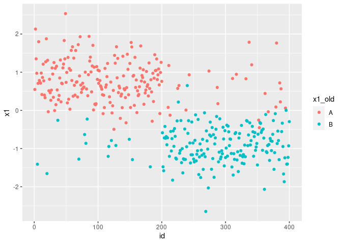

# UFT <a href='https://github.com/ranibasna/NumericalTransformation/'></a>

[](https://travis-ci.com/ranibasna/NumericalTransformation)
[](https://ci.appveyor.com/project/ranibasna/NumericalTransformation)
[](https://codecov.io/gh/ranibasna/NumericalTransformation?branch=master)

<!-- README.md is generated from README.Rmd. Please edit that file -->

# NumericTransformation

his package intends to convert categorical features into numerical ones.
This will help in employing algorithms and methods that only accept
numerical data as input. The main motivation for writing this package is
to use in clustering assignments.

## Installation

<!-- You can install the released version of NumericTransformation from [CRAN](https://CRAN.R-project.org) with: -->

–&gt;

<!-- ``` r -->
<!-- install.packages("NumericTransformation") -->
<!-- ``` -->

You can install the development version from
[GitHub](https://github.com/) with:

``` r
# install.packages("devtools")
devtools::install_github("ranibasna/NumericalTransformation")
```

## Example

This is a basic example which shows you how to convert a categorical
features to numerical ones:

``` r
library(ggplot2)
library(NumericTransformation)
library(dplyr)
#> 
#> Attaching package: 'dplyr'
#> The following objects are masked from 'package:stats':
#> 
#>     filter, lag
#> The following objects are masked from 'package:base':
#> 
#>     intersect, setdiff, setequal, union
## basic example code
```

``` r
# Generate toy data with categorical and numerical columns
n   <- 100
prb <- 0.5
muk <- 1.5
clusid <- rep(1:4, each = n)

x1 <- sample(c("A","B"), 2*n, replace = TRUE, prob = c(prb, 1-prb))
x1 <- c(x1, sample(c("A","B"), 2*n, replace = TRUE, prob = c(1-prb, prb)))
x1 <- as.factor(x1)

x2 <- sample(c("A","B"), 2*n, replace = TRUE, prob = c(prb, 1-prb))
x2 <- c(x2, sample(c("A","B"), 2*n, replace = TRUE, prob = c(1-prb, prb)))
x2 <- as.factor(x2)

x3 <- c(rnorm(n, mean = -muk), rnorm(n, mean = muk), rnorm(n, mean = -muk), rnorm(n, mean = muk))
x4 <- c(rnorm(n, mean = -muk), rnorm(n, mean = muk), rnorm(n, mean = -muk), rnorm(n, mean = muk))

x <- data.frame(x1,x2,x3,x4)
summary(x)
#>  x1      x2            x3                  x4          
#>  A:217   A:194   Min.   :-3.749330   Min.   :-4.24850  
#>  B:183   B:206   1st Qu.:-1.417845   1st Qu.:-1.44877  
#>                  Median :-0.002316   Median : 0.09057  
#>                  Mean   : 0.024370   Mean   : 0.04117  
#>                  3rd Qu.: 1.473889   3rd Qu.: 1.59126  
#>                  Max.   : 3.962709   Max.   : 4.35724
```

``` r
# converting the numerical data using UFT_func
x_converted_data <- UFT_func(x, Seed = 22)
#head(x_converted_data)
# bined with the rest of the data
x_converted_data_all <- bined_converted_func(converted_data = x_converted_data, original_data = x)
head(x_converted_data_all)
#>           x1         x2         x3        x4
#> 1 -0.2749332  0.6391452 -0.6349824 -1.257009
#> 2  0.5145778 -0.9244997 -1.7980693 -2.038357
#> 3 -1.2199346 -0.6433292 -2.3130037 -1.182519
#> 4 -0.9694521 -1.5752906 -1.5729009 -2.420783
#> 5  2.1406254  1.8247216 -1.0177460 -2.779858
#> 6  1.3391589 -0.6318220 -1.2007982 -1.438790
```

``` r
x_converted_data_all <- x_converted_data_all %>% dplyr::mutate(id = row_number())
head(x_converted_data_all)
#>           x1         x2         x3        x4 id
#> 1 -0.2749332  0.6391452 -0.6349824 -1.257009  1
#> 2  0.5145778 -0.9244997 -1.7980693 -2.038357  2
#> 3 -1.2199346 -0.6433292 -2.3130037 -1.182519  3
#> 4 -0.9694521 -1.5752906 -1.5729009 -2.420783  4
#> 5  2.1406254  1.8247216 -1.0177460 -2.779858  5
#> 6  1.3391589 -0.6318220 -1.2007982 -1.438790  6
```

``` r
# plotiing
# adding old non-numerical features
x_converted_data_all$x1_old <- x$x1

ggplot(x_converted_data_all, aes(x=id, y=x1, color=x1_old)) + geom_point()
```


``` r
ggplot(x_converted_data_all, aes(x=x1), color=x1_old) + geom_histogram(bins = 30, color = "black", fill = "gray") 
```


## to see clusters

``` r
n   <- 100
prb <- 0.9 # we put the prb to 0.9 for clear clusters
muk <- 1.5
clusid <- rep(1:4, each = n)

x1 <- sample(c("A","B"), 2*n, replace = TRUE, prob = c(prb, 1-prb))
x1 <- c(x1, sample(c("A","B"), 2*n, replace = TRUE, prob = c(1-prb, prb)))
x1 <- as.factor(x1)

x2 <- sample(c("A","B"), 2*n, replace = TRUE, prob = c(prb, 1-prb))
x2 <- c(x2, sample(c("A","B"), 2*n, replace = TRUE, prob = c(1-prb, prb)))
x2 <- as.factor(x2)

x3 <- c(rnorm(n, mean = -muk), rnorm(n, mean = muk), rnorm(n, mean = -muk), rnorm(n, mean = muk))
x4 <- c(rnorm(n, mean = -muk), rnorm(n, mean = muk), rnorm(n, mean = -muk), rnorm(n, mean = muk))

x <- data.frame(x1,x2,x3,x4)
```

``` r
# converting the numerical data using UFT_func
x_converted_data <- UFT_func(x, Seed = 22)
#head(x_converted_data)
# bined with the rest of the data
x_converted_data_all <- bined_converted_func(converted_data = x_converted_data, original_data = x)
head(x_converted_data_all)
#>           x1         x2         x3         x4
#> 1  0.5482406 -0.9598341 -0.6721997 -1.3640539
#> 2  2.1293284  0.6497559 -3.4891224 -1.2824085
#> 3  1.3500223  1.8238219 -1.8073841 -0.7831971
#> 4  0.9728537 -1.1876765 -3.3130884 -1.2942845
#> 5 -1.4094992 -0.9161744 -2.8428968  0.3910824
#> 6  0.7081679 -0.6321053 -0.9697318 -1.5089555
```

``` r
# plotiing
x_converted_data_all <- x_converted_data_all %>% mutate(id = row_number())
# adding old non-numerical features
x_converted_data_all$x1_old <- x$x1
ggplot(x_converted_data_all, aes(x=id, y=x1, color=x1_old)) + geom_point()
```



``` r
ggplot(x_converted_data_all, aes(x=x1), color=x1_old) + geom_histogram(bins = 30, color = "black", fill = "gray")
```


