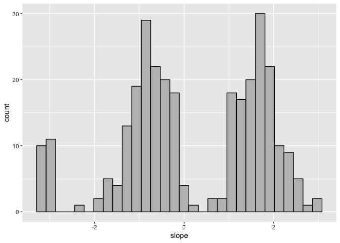

[](https://travis-ci.com/ranibasna/NumericalTransformation)

<!-- README.md is generated from README.Rmd. Please edit that file -->

# NumericTransformation

his package intends to convert categorical features into numerical ones.
This will help in employing algorithms and methods that only accept
numerical data as input. The main motivation for writing this package is
to use in clustering assignments.

## Installation

You can install the released version of NumericTransformation from
[CRAN](https://CRAN.R-project.org) with:

``` r
install.packages("NumericTransformation")
```

And the development version from [GitHub](https://github.com/) with:

``` r
# install.packages("devtools")
devtools::install_github("ranibasna/NumericalTransformation")
```

## Example

This is a basic example which shows you how to convert a categorical
features to numerical ones:

``` r
library(ggplot2)
library(NumericTransformation)
library(MixAll)
#> Loading required package: rtkore
#> Loading required package: Rcpp
#> 
#> Attaching package: 'rtkore'
#> The following object is masked from 'package:Rcpp':
#> 
#>     LdFlags
library(dplyr)
#> 
#> Attaching package: 'dplyr'
#> The following objects are masked from 'package:stats':
#> 
#>     filter, lag
#> The following objects are masked from 'package:base':
#> 
#>     intersect, setdiff, setequal, union
## basic example code
```

What is special about using `README.Rmd` instead of just `README.md`?
You can include R chunks like so:

``` r
# heart data
library(MixAll)
data("HeartDisease.cat")
data("HeartDisease.cont")
Heart_data <- cbind(HeartDisease.cat, HeartDisease.cont)
summary(Heart_data)
#>       sex               cp             fbs            restecg      
#>  Min.   :0.0000   Min.   :1.000   Min.   :0.0000   Min.   :0.0000  
#>  1st Qu.:0.0000   1st Qu.:3.000   1st Qu.:0.0000   1st Qu.:0.0000  
#>  Median :1.0000   Median :3.000   Median :0.0000   Median :1.0000  
#>  Mean   :0.6799   Mean   :3.158   Mean   :0.1485   Mean   :0.9901  
#>  3rd Qu.:1.0000   3rd Qu.:4.000   3rd Qu.:0.0000   3rd Qu.:2.0000  
#>  Max.   :1.0000   Max.   :4.000   Max.   :1.0000   Max.   :2.0000  
#>                                                                    
#>      exang            slope             ca              thal      
#>  Min.   :0.0000   Min.   :1.000   Min.   :0.0000   Min.   :3.000  
#>  1st Qu.:0.0000   1st Qu.:1.000   1st Qu.:0.0000   1st Qu.:3.000  
#>  Median :0.0000   Median :2.000   Median :0.0000   Median :3.000  
#>  Mean   :0.3267   Mean   :1.601   Mean   :0.6722   Mean   :4.734  
#>  3rd Qu.:1.0000   3rd Qu.:2.000   3rd Qu.:1.0000   3rd Qu.:7.000  
#>  Max.   :1.0000   Max.   :3.000   Max.   :3.0000   Max.   :7.000  
#>                                   NA's   :4        NA's   :2      
#>       age           trestbps          chol          thalach         oldpeak    
#>  Min.   :29.00   Min.   : 94.0   Min.   :126.0   Min.   : 71.0   Min.   :0.00  
#>  1st Qu.:48.00   1st Qu.:120.0   1st Qu.:211.0   1st Qu.:133.5   1st Qu.:0.00  
#>  Median :56.00   Median :130.0   Median :241.0   Median :153.0   Median :0.80  
#>  Mean   :54.44   Mean   :131.7   Mean   :246.7   Mean   :149.6   Mean   :1.04  
#>  3rd Qu.:61.00   3rd Qu.:140.0   3rd Qu.:275.0   3rd Qu.:166.0   3rd Qu.:1.60  
#>  Max.   :77.00   Max.   :200.0   Max.   :564.0   Max.   :202.0   Max.   :6.20  
#> 
```

``` r
# checking for missing values
sort(apply(Heart_data, 2, function(x){sum(is.na(x))}), decreasing = TRUE)
#>       ca     thal      sex       cp      fbs  restecg    exang    slope 
#>        4        2        0        0        0        0        0        0 
#>      age trestbps     chol  thalach  oldpeak 
#>        0        0        0        0        0
# converting the variables to factors
Heart_data <- na.omit(Heart_data)
Heart_data <- sapply(Heart_data, as.integer) %>% as.data.frame()
#Heart_data <-  sapply(Heart_data, as.factor)
heart_converted_data <- UFT_func(as.data.frame(Heart_data), Seed = 22)
```

``` r
heart_converted_data <- heart_converted_data %>% mutate(id = row_number())
# adding old non-numerical features
heart_converted_data$sex_old <- Heart_data$sex 
ggplot(heart_converted_data, aes(x=id, y=sex, color=sex_old)) + geom_point()
```


``` r
ggplot(heart_converted_data, aes(x=sex), color=sex_old) + geom_histogram(bins = 30, color = "black", fill = "gray") 
```


``` r
heart_converted_data$slope_old <- Heart_data$slope
ggplot(heart_converted_data, aes(x=id, y=slope, color=slope_old)) + geom_point()
```


``` r
ggplot(heart_converted_data, aes(x=slope), color=slope_old) + geom_histogram(bins = 30, color = "black", fill = "gray") 
```


