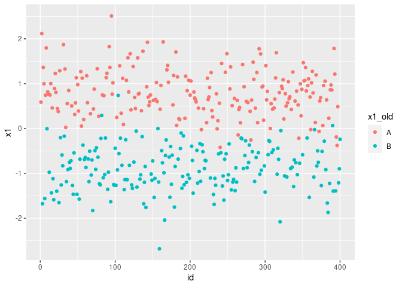
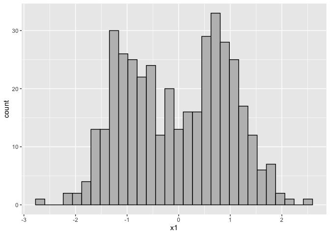

[](https://travis-ci.com/ranibasna/NumericalTransformation)

<!-- README.md is generated from README.Rmd. Please edit that file -->

# NumericTransformation

his package intends to convert categorical features into numerical ones.
This will help in employing algorithms and methods that only accept
numerical data as input. The main motivation for writing this package is
to use in clustering assignments.

<!-- badges: start -->

<!-- badges: end -->

## Installation

You can install the released version of NumericTransformation from
[CRAN](https://CRAN.R-project.org) with:

``` r
install.packages("NumericTransformation")
```

And the development version from [GitHub](https://github.com/) with:

``` r
# install.packages("devtools")
devtools::install_github("ranibasna/NumericalTransformation")
```

## Example

This is a basic example which shows you how to convert a categorical
features to numerical ones:

``` r
library(ggplot2)
library(NumericTransformation)
library(MixAll)
#> Loading required package: rtkore
#> Loading required package: Rcpp
#> 
#> Attaching package: 'rtkore'
#> The following object is masked from 'package:Rcpp':
#> 
#>     LdFlags
library(dplyr)
#> 
#> Attaching package: 'dplyr'
#> The following objects are masked from 'package:stats':
#> 
#>     filter, lag
#> The following objects are masked from 'package:base':
#> 
#>     intersect, setdiff, setequal, union
## basic example code
```

What is special about using `README.Rmd` instead of just `README.md`?
You can include R chunks like so:

``` r
summary(cars)
#>      speed           dist       
#>  Min.   : 4.0   Min.   :  2.00  
#>  1st Qu.:12.0   1st Qu.: 26.00  
#>  Median :15.0   Median : 36.00  
#>  Mean   :15.4   Mean   : 42.98  
#>  3rd Qu.:19.0   3rd Qu.: 56.00  
#>  Max.   :25.0   Max.   :120.00
```

``` r
# heart data
library(MixAll)
data("HeartDisease.cat")
data("HeartDisease.cont")
Heart_data <- cbind(HeartDisease.cat, HeartDisease.cont)
# checking for missing values
sort(apply(Heart_data, 2, function(x){sum(is.na(x))}), decreasing = TRUE)
#>       ca     thal      sex       cp      fbs  restecg    exang    slope 
#>        4        2        0        0        0        0        0        0 
#>      age trestbps     chol  thalach  oldpeak 
#>        0        0        0        0        0
# converting the variables to factors
Heart_data <- na.omit(Heart_data)
Heart_data <- sapply(Heart_data, as.integer) %>% as.data.frame()
#Heart_data <-  sapply(Heart_data, as.factor)
heart_converted_data <- UFT_func(as.data.frame(Heart_data), Seed = 22)
```

``` r

heart_converted_data <- heart_converted_data %>% mutate(id = row_number())
# adding old non-numerical features
heart_converted_data$sex_old <- Heart_data$sex 
ggplot(heart_converted_data, aes(x=id, y=sex, color=sex_old)) + geom_point()
```



``` r
ggplot(heart_converted_data, aes(x=heart_converted_data$sex), color=sex_old) + geom_histogram(bins = 30, color = "black", fill = "gray") 
```


``` r
heart_converted_data$slope_old <- Heart_data$slope
ggplot(heart_converted_data, aes(x=id, y=slope, color=slope_old)) + geom_point()
```



``` r
ggplot(heart_converted_data, aes(x=heart_converted_data$slope), color=slope_old) + geom_histogram(bins = 30, color = "black", fill = "gray") 
```


